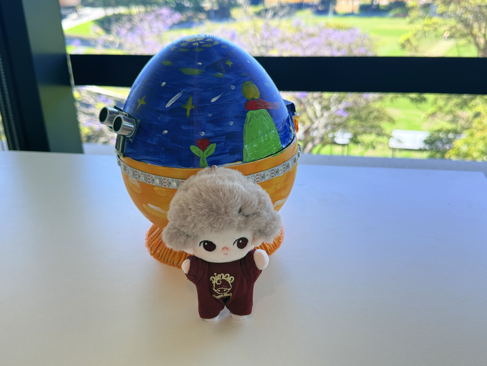

# “Ready Player One” — Easter Egg Hunt

## The Key

Main file:

```
main_heart_led.cpp
```

## The Egg Unlock

Main file:

```
main_egg.cpp
```

## The Egg Distance Detect

Main file:

```
main_distance_led.cpp
```

Multiplexer for egg distance ani:

```
# Start the multiplexer
python3 scripts/serial_multiplexer.py /dev/cu.wchusbserial210 115200
```

## The AI Assistant

Main file:

```
main_speaker.cpp
```

Gemini API Server:
```
cd server

python3 gemini_proxy_debug.py
```

## Pictures





